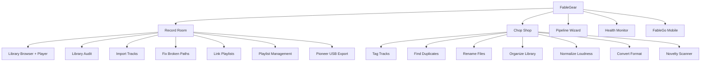

<div align="center">


# FableGear

**Local-first Rekordbox library toolkit for macOS**

### [Download FableGear for macOS](https://github.com/fabledharbinger0993/FableGear/releases/latest/download/FableGear.zip)


**Free -- Open source (MIT) -- No account -- No cloud -- No telemetry**

</div>

---

## What is FableGear?

FableGear is a desktop app for DJs who use Rekordbox. It gives you tools to clean up, repair, and manage your music library that go beyond what Rekordbox offers on its own.

Everything runs on your Mac. There is no cloud service, no login, and no data leaves your machine. FableGear reads and writes your Rekordbox database and audio files directly, so you stay in full control of your collection.

---

## How it is organized

FableGear has two main workspaces. **Record Room** handles everything tied to your Rekordbox database -- browsing tracks, managing playlists, fixing broken paths. **Chop Shop** works on your actual audio files -- tagging, deduping, normalizing loudness, renaming, converting formats.



---

## Record Room -- Rekordbox database tools

These tools read from and write to your Rekordbox database.

| Tool | What it does |
|---|---|
| **Library Browser + Player** | Browse your tracks with BPM, key, duration, and file path. Play tracks with waveform display. Split-view browsing of your filesystem alongside database entries. |
| **Library Audit** | Scans your Rekordbox database against your actual drives. Finds broken paths, orphaned entries, missing files, and tracks with no BPM or key tags. |
| **Import Tracks** | Adds new audio files to Rekordbox. Supports dry-run previews and creates a backup before any writes. |
| **Fix Broken Paths** | Bulk-updates file paths in the database when a drive remounts with a different name or files have been moved. |
| **Link Playlists** | Maps your folder structure to Rekordbox playlist names after imports or reorganizations. |
| **Playlist Management** | Create, rename, delete, and reorder playlists. Add and remove tracks. |
| **Pioneer USB Export** | Exports playlists to a USB drive in the directory format Pioneer players expect. |

---

## Chop Shop -- audio file tools

These tools work on your physical audio files, not the Rekordbox database.

| Tool | What it does |
|---|---|
| **Tag Tracks** | Analyzes your audio and writes BPM and musical key into the file's metadata tags. This means the info survives even if you rebuild your Rekordbox database or use the files outside Rekordbox. |
| **Find and Prune Duplicates** | Uses acoustic fingerprinting to detect the same recording even when the filenames, formats, or bitrates are different. Not just a filename check -- it listens to the audio. |
| **Rename Files** | Batch rename files using patterns or learned rules from example pairs. Shows you a preview before anything changes. |
| **Organize Library** | Rebuilds your folder structure based on embedded metadata (artist, album, etc.). Handles album artist intelligently so featured artists don't create extra folders. |
| **Normalize Loudness** | Measures loudness (EBU R128) and re-encodes tracks that fall outside your target level. Preview and backup included. |
| **Convert Format** | Re-encodes a folder of audio files into a target format (e.g., FLAC to AIFF, WAV to MP3). |
| **Novelty Scanner** | Scans another drive for tracks that are not already in your main library, based on acoustic fingerprints. Useful for finding new music across external drives or a friend's collection. |

---

## Pipeline Wizard

The Pipeline Wizard lets you chain multiple Chop Shop tools into a single automated run. Instead of running each tool one at a time, you build a sequence and let it execute.

Two modes:

- **Auto mode** -- runs straight through every step
- **Confirm between steps** -- pauses after each step so you can review the results before continuing

At each pause you can re-do the step, skip it, or stop the pipeline entirely.

---

## Safety -- how FableGear protects your library

FableGear is built to be cautious. Writing to a Rekordbox database incorrectly can break your library, so every write operation has guardrails.

- **Rekordbox must be closed** before any write operation. FableGear checks for this.
- **Write actions require your explicit confirmation.** Nothing changes without you saying yes.
- **Dry-run and preview modes** are available wherever practical, so you can see what will happen before it happens.
- **Automatic backups** are created before destructive database operations.
- **Health Monitor** runs at startup and on demand, checking for risky conditions before you proceed.

The Health Monitor looks for things like:

- Rekordbox still running during a write attempt
- iCloud or Dropbox syncing your library folder (this causes corruption)
- Suspicious database size changes
- Read-only volume mounts
- Backups stored on the same drive as the database
- Low disk space
- Symlinked database files

Findings are shown with severity levels. Safe auto-fixes are applied where appropriate.

---

## FableGo -- mobile companion

FableGo is a mobile web interface that connects to FableGear over your local Wi-Fi network. If you use Tailscale, it also works remotely.

From your phone or tablet you can:

- Browse your music folders
- Trigger downloads with live progress
- Browse, create, edit, and delete Rekordbox playlists
- Add and remove tracks from playlists
- Trigger BPM and key analysis jobs
- Browse connected drives and export playlists to Pioneer USB

FableGo uses token-based authentication from your local config. The FableGear desktop app must be running for FableGo to connect.

---

## Install

### One-command install (recommended)

Open Terminal and paste this:

```bash
curl -fsSL https://raw.githubusercontent.com/fabledharbinger0993/FableGear/main/install.sh | bash
```

This installs dependencies, clones the repository, and launches FableGear. A setup window walks you through anything that still needs configuring.

### Manual download

1. Click **Download FableGear for macOS** at the top of this page
2. Unzip the archive
3. Open **FableGear.app**
4. If macOS blocks the first launch, right-click the app and choose **Open**

On first launch, FableGear can also create a native Dock launcher on your Mac.

---

## Requirements

- macOS Monterey 12.0 or later
- Apple Silicon or Intel Mac
- Internet connection for first-time setup (to install dependencies)
- Rekordbox must be closed for any write operation

### System dependencies (installed via Homebrew)

- `ffmpeg` -- audio processing and format conversion
- `chromaprint` / `fpcalc` -- acoustic fingerprinting for duplicate detection

---

## Quick start

1. Install and launch FableGear
2. Let the first-run setup complete
3. Point it at your Rekordbox database and music root folder
4. Run **Library Audit** first -- always audit before changing anything
5. Review any health warnings before running write operations
6. Use dry-run and preview modes whenever they are available

For large or older libraries, a safe order of operations is:

```
Audit --> Fix paths --> Detect duplicates --> Tag / Normalize --> Organize --> Import --> Relink playlists
```

---

## Under the hood

FableGear is a Flask app that runs a local server on port 5001 and opens in a native macOS window via pywebview. The UI is vanilla HTML/CSS/JS -- no frontend framework.

| Library | Purpose |
|---|---|
| [pyrekordbox](https://github.com/dylanljones/pyrekordbox) | Read/write access to the Rekordbox SQLite database |
| [librosa](https://librosa.org) | BPM detection, beat tracking, key detection, chroma analysis |
| [Chromaprint / fpcalc](https://acoustid.org/chromaprint) | Acoustic fingerprinting for duplicate detection |
| [mutagen](https://mutagen.readthedocs.io) | Audio metadata (tag) reading and writing |
| [pyloudnorm](https://github.com/csteinmetz1/pyloudnorm) | EBU R128 integrated loudness measurement |
| [Flask](https://flask.palletsprojects.com) + [Waitress](https://docs.pylonsproject.org/projects/waitress) | Local application server |
| [pywebview](https://pywebview.flowrl.com) | Native desktop window wrapper |
| [flask-sock](https://flask-sock.readthedocs.io) | WebSocket support for live progress and companion-device events |

---

## Built by

**Guthrie Entertainment LLC** -- Free and open source -- [github.com/fabledharbinger0993](https://github.com/fabledharbinger0993)
